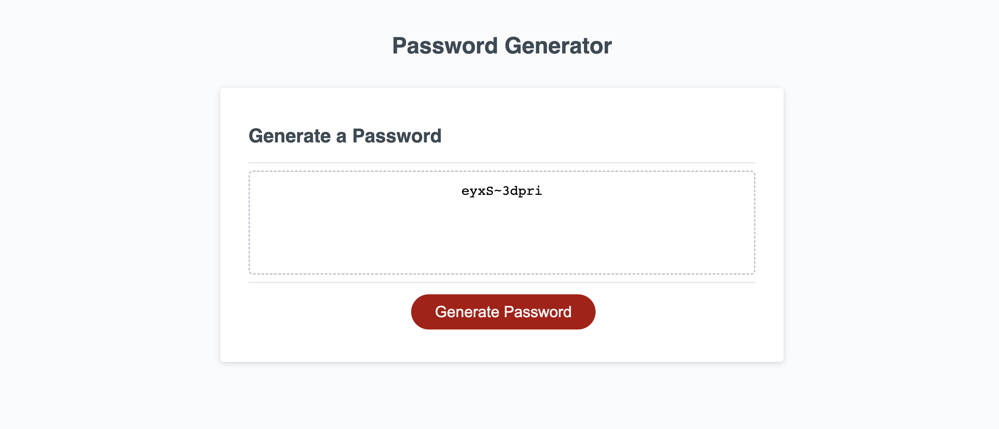

# <password-generator>

## Description

The application should prompt the user a series of questions regarding generating a random password.

Given a skeleton of the program that stubbed out the front end along with its respected html/css, we were asked to write js code to prompt the user a series of questions to how a password should be generated. Such questions regarding this were a uppercase letter, lowercase letter, number, and/or a special character should be included. Upon providing this information, the user was then displayed a password following the constraints. 

When building this application, the biggest challenge was building the password after the constraints. Allowing the algorithm to select random values for the characters, filling the remaining spaces in the password with lower case letters, then shuffling the string randomly allowed me to achieve this task of a "randomized password generator."

## Installation

 * To deploy application, go to [My Github Project](https://erickjavalos.github.io/password-generator/)

## Usage

 * Click "Generate Password"
 * Enter desired length of password into box
 * Click "OK" for character types you would like to include. Click "cancel" for the ones you do NOT want to include.
 * Complete all prompts

